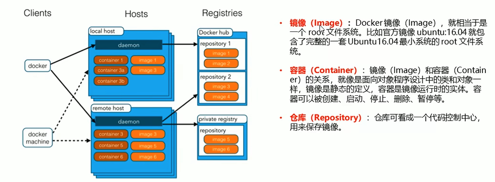
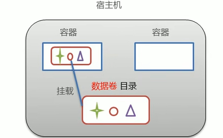
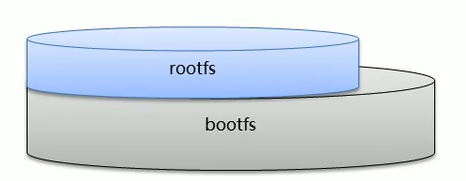
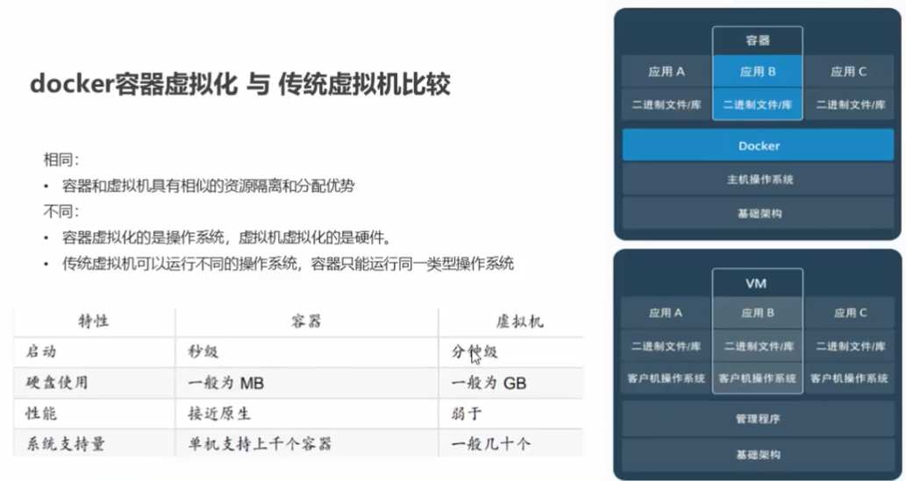

# Docker
## Docker概念
    1. Docker是一个开源的应用容器引擎
    2. 诞生于2013年初，基于Go语言实现，dotCloud公司出品(后改名Docker Inc)
    3. Docker可以让开发者打包他们的应用以及依赖包到一个轻量级、可移植的容器中，然后发布到任何流行的Linux机器上
    4. 容器是完全使用沙盒机制，相互隔离
    5. 容器性能开销极低
    6. Docker从17.03版本之后分为CE(Community Edition: 社区版)和EE(Enterprise Edition: 企业版)

    小结：Docker是一种容器技术，解决软件跨环境迁移问题

## 安装Docker
   Docker可以运行在MAC, Windows, CentOS, Ubuntu等操作系统上。官网：https://www.docker.com
   1. 系统要求：
      1. 确保你的Mac满足以下要求：macOS 10.14（Mojave）或更高版本（也有说法是macOS 10.15或更高版本）。
      2. 至少4GB RAM。
   2. 下载Docker Desktop：
      1. 访问Docker的官方网站（Docker Hub：https://www.docker.com/）或使用官方提供的下载链接。
      2. 点击“Download for Mac”按钮，下载Docker Desktop安装包。
      3. 找到你下载的Docker Desktop安装包（通常在“下载”文件夹中）。
   3. 安装Docker Desktop
      1. 双击.dmg文件打开安装包。
      2. 将Docker图标拖动到“应用程序”文件夹中。
      3. 打开“应用程序”文件夹，找到Docker图标并双击打开。
      4. 初次启动时，可能会要求你输入系统密码以进行安装和配置。Docker会在顶部菜单栏显示一个鲸鱼图标，表示它正在运行。
   4. 验证安装
      1. 打开终端（Terminal）。
      2. 输入以下命令来验证Docker是否安装成功：docker --version
   5. 运行测试容器
      1. docker run hello-world
      2. 如果一切正常，你应该会看到一条欢迎信息，说明Docker已经成功安装并运行。

## Docker架构

## Docker镜像加速器
   1. USTC
   2. 阿里云
   3. 网易云
   4. 腾讯云

## Docker命令
### Docker服务相关命令
   1. 启动Docker服务
      1. linux: $ systemctrl start docker
      2. macos: $ open /Applications/Docker.app
   2. 停止Docker服务
      1. linux: $ systemctrl stop docker
   3. 重启Docker服务
      1. linux: $ systemctrl restart docker
   4. 查看Docker服务状态
      1. linux: $ systemctrl status docker
   5. 开机启动Docker服务
      1. linux: $ systemctrl enable docker
### Docker镜像相关命令
   1. 查看镜像: $ docker images
   2. 查看全部镜像ID: docker images -q
   3. 搜索镜像: $ docker search [镜像名]
   4. 拉取镜像: $ docker pull [镜像名]:[版本号]
      1. mac上获取linux容器: $ docker pull ubuntu:latest
   5. 删除镜像: 
      1. 删除单个镜像: $ docker rmi [image ID]
      2. 删除全部镜像: $ docker rmi `docker images -q` 
### Docker容器相关命令
   1. 创建容器并启动容器:
      1. -i: 保持容器运行，通常与-t同时使用，加入it这两个参数后，容器创建后自动进入容器中，退出容器后，容器自动关闭。
      2. -t: 为容器重新分配一个伪输入终端，通常与-i同时使用。
      3. -d: 以守护(后台)模式运行容器，创建一个容器在后台运行，需要使用docker exec进入容器，退出后，容器不会关闭。
      4. -it: 创建的容器一般为交互式容器，-id创建的容器一般为守护式容器。
      5. --name: 为创建的容器的名字。
      6. $ docker run -it --name=[容器名] [image name]:[tag] /bin/bash
   2. 进入容器(退出容器，容器不会关闭): $ docker exec [参数]
   3. 退出容器: $ exit
   4. 查看容器:
      1. 正在运行的容器: $ docker ps
      2. 所有容器: $ docker ps -a
   5. 停止容器: $ docker stop [容器名称]
   6. 删除容器: $ docker rm [容器名称]

## Docker容器数据卷
### 数据卷的概念及作用

   1. 数据卷：
      1. 数据卷是宿主机中的一个目录或文件
      2. 当容器目录和数据卷目录绑定后，对方的修改会立即同步
      3. 一个数据卷可以被多个容器同时挂载
      4. 一个容器可以挂载多个数据卷
   2. 数据卷的作用：
      1. 容器数据持久化
      2. 外部机器和容器间接通讯
      3. 容器之间数据交换
### 配置数据卷
   1. 创建启动容器时，使用-v参数设置数据卷：$ docker run ... -v [宿主机目录(文件)]:[容器内目录(文件)] ...
   2. 注意事项：
      1. 目录必须是绝对路径
      2. 如果目录不存在，会自动创建
      3. 可以挂载多个数据卷
### 数据卷容器
   多容器进行数据交换
      1. 多个容器挂载同一个数据卷
      2. 数据卷容器
   1. 创建启动c3数据卷容器，使用-v参数设置数据卷
      1. $ docker run -it --name=c3 -v /volume centos:7 /bin/bash
   2. 创建启动c1 c2容器，使用--volumes-from参数设置数据卷
      1. $ docker run -it --name=c1 --volumes-from centos:7 /bin/bash
      2. $ docker run -it --name=c2 --volumes-from centos:7 /bin/bash

## Dockerfile
### Docker镜像原理
   1. 思考：
      1. Docker镜像的本质是什么？
         1. 分层的文件系统
      2. Docker中一个centos镜像为什么只有200MB，而一个centos操作系统的iso要几个G？
         1. Centos的iso镜像文件包含bootfs和rootfs，而docker的centos镜像复用操作系统的bootfs，只有rootfs个其他镜像层
   2. 操作系统组成部分：
      1. 进程调度子系统
      2. 进程通讯子系统
      3. 内存管理子系统
      4. 设备管理子系统
      5. 文件管理子系统
         1. Linux文件系统由bootfs和rootfs两部分组成 
            1. bootfs：包含bootloader(引导加载程序)和kernel(内核)
            2. rootfs：root文件系统，包含的就是典型Linux系统中的/dev, /proc, /bin, /etc等标准目录和文件
         2. 不同的linux发行版，bootfs基本一样，而rootfs不同，比如：ubuntu，centos等
      6. 网络通讯子系统
      7. 作业控制子系统
   3. Docker镜像原理
      1. Docker镜像是由特殊的文件系统叠加而成
      2. 最底层的bootfs，并使用宿主机的bootfs
      3. 第二层是root文件系统rootfs，称为base image
      4. 然后再往上可以叠加其他的镜像文件
### Dockerfile概念及作用
   1. 容器转为镜像：
      1. $ docker commit [容器id] [镜像名称]:[版本号]
      2. $ docker save -o [压缩文件名称] [镜像名称]:[版本号]
      3. $ docker load -i [压缩文件名称]
### Dockerfile关键字
   1. Dockerfile是一个文本文件，包含了一条条的指令
   2. 每一条指令构建一层，基于基础镜像，最终构建出一个新的镜像
   3. 对于开发人员：可以为团队提供一个完全一致的开发环境
   4. 对于测试人员：可以直接拿开发时所构建的镜像或者通过Dockerfile文件构建一个新的镜像开始工作
   5. 对于运维人员：在部署时，可以实现应用的无缝移植
### 案例

## 容器与虚拟机

### 相同
   1. 容器和虚拟机具有相似的资源隔离和分配优势
### 不同
   1. 容器虚拟化的是操作系统，虚拟机虚拟化的是硬件
   2. 传统虚拟机可以运行不同的操作系统，容器只能运行同一类型操作系统

## 应用
### 创建一次性docker容器
      在Docker中，"一次性容器"（有时也被称为"临时容器"或"短暂容器"）通常指的是那些被设计为运行单个任务或命令，然后自动停止的容器。这种容器的使用场景包括执行短暂的测试、数据转换、临时服务等。
   步骤：
   1. 选择基础镜像：首先，你需要选择一个基础镜像。这可以是一个官方的Docker镜像，如ubuntu、alpine等，也可以是你自己的自定义镜像。
   2. 运行容器：使用docker run命令运行容器，并在命令后指定要执行的命令。例如，如果你想要运行一个Ubuntu容器并列出其根目录下的文件，你可以使用以下命令：$ docker run --rm ubuntu ls /
   3. 使用--rm选项可以确保容器在停止后被自动删除，从而避免不必要的资源占用。
