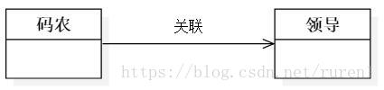

# 类之间的六大关系
## 一、泛化关系（Generalization）
        说明：这种关系就是面向对象语言中的继承关系，逻辑上可以用"is a"表示。
        代码体现：子类继承父类。
        UML符号：一条实线+空心箭头。
        图示：

## 二、实现关系（Realization）
        说明：和泛化关系相似，逻辑上也是用"is a"表示。区别在于实现关系继承一个抽象类（abstract、interface），
        而泛化关系继承一个具体类。 
        代码体现：实现接口或继承某个抽象类。
        UML符号：一条虚线+空心箭头。
        图示：

## 三、组合关系（Composition）

       说明：是整体与部分的关系，但部分不能脱离整体而独立存在。逻辑上能用"has a"表示。
       代码体现：成员变量。
       UML符号：一条实线+实心菱形。
       图示：

## 四、聚合关系（Aggregation）
       说明：是整体与部分的关系，部分能脱离整体而独立存在。逻辑上能用"has a"表示。
       代码体现：成员变量
       UML符号：一条实线+空心菱形
       图示：

## 五、关联关系（Association）
       说明：是整体与部分的关系。逻辑上能用"has a"表示。
       代码体现：成员变量。
       UML符号：双向关联，一条实线或一条实线+两个箭头；单向关联，一条实线+一个箭头。
       图示：

## 六、依赖关系（Dependency）

        说明：是一种使用关系，即一个类的实现需要另一个类的协助。逻辑上能用"use a"表示。
        尽量不要使用双向依赖。
        代码体现：局部变量、方法的参数和静态方法的调用。
        UML符号：一条虚线+箭头。
        图示：
   

## 总结：
        1. 六种关系的耦合度大小是：泛化 = 实现 > 组合 > 聚合 > 关联 > 依赖
        2. 泛化和实现体现了逻辑上的"is a"的关系，组合、聚合和关联体现了逻辑上的"has a"的关系，“依赖”体现了逻辑上的"use a"的关系。
        3. 写这篇博客的目的是为学习设计模式和阅读开源框架的源码打基础。
